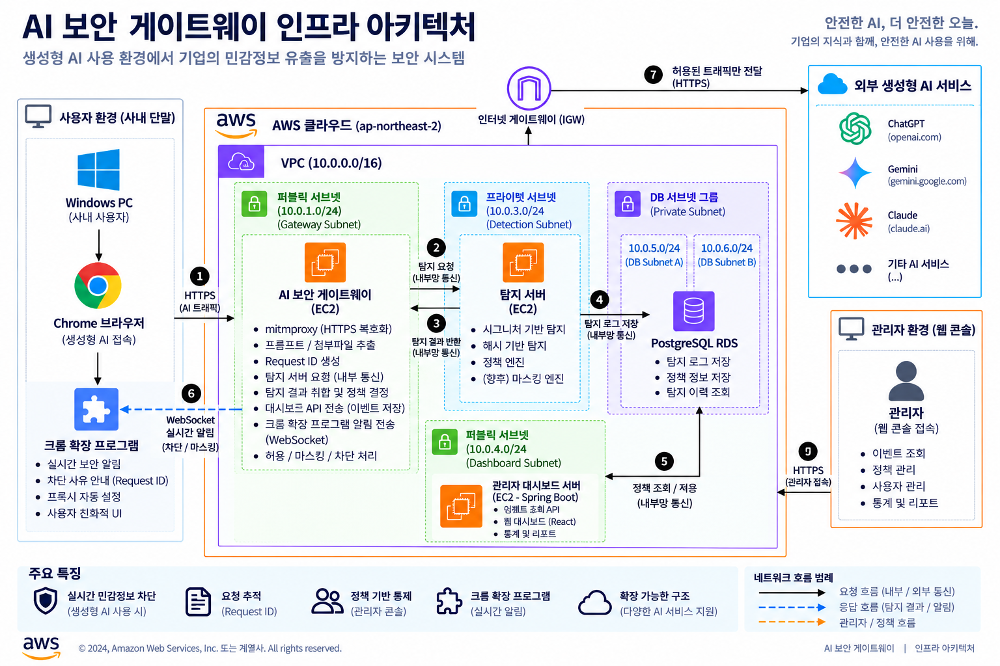

# 1. System Architecture

## 1.1 Overview

PromptGate는 생성형 AI 서비스 이용 시 발생할 수 있는 기밀문서 및 개인정보 유출을 방지하기 위한 AI Security Gateway입니다.

모든 사용자 요청은 Gateway를 통해 수신되며, Detection 서버에서 보안 검사를 수행한 후 허용된 요청만 외부 LLM(OpenAI API)으로 전달됩니다. 탐지 결과는 PostgreSQL RDS에 저장되고, Dashboard를 통해 관리자가 탐지 현황과 로그를 확인할 수 있도록 구성하였습니다.

---

## 1.2 AWS Architecture

> AWS Infrastructure Diagram



---

## 1.3 Architecture Components

### Gateway EC2

Gateway는 시스템의 진입점(Entry Point)으로 모든 사용자 요청을 가장 먼저 처리하는 프록시 서버입니다.

**주요 역할**

- HTTPS 요청 수신
- mitmproxy 기반 프록시 동작
- Detection API 호출
- 탐지 결과에 따른 Allow / Block 처리
- 허용된 요청만 외부 LLM(OpenAI API)으로 전달

---

### Detection EC2

Detection 서버는 Gateway에서 전달받은 요청을 분석하여 기밀문서 및 개인정보 유출 여부를 검사하는 핵심 서비스입니다.

**주요 역할**

- Window Hash 기반 기밀문서 탐지
- Signature 기반 개인정보 탐지
- 탐지 결과 생성
- 탐지 로그 생성 및 LogShipper 전달

---

### PostgreSQL RDS

Detection 서버에서 생성한 탐지 로그와 운영 데이터를 저장하는 데이터베이스입니다.

**주요 역할**

- 탐지 로그 저장
- 탐지 이력 관리
- Dashboard 조회 데이터 제공

---

### Dashboard EC2

Dashboard는 관리자 전용 운영 페이지입니다.

**주요 역할**

- 탐지 로그 조회
- 탐지 통계 시각화
- 운영 현황 모니터링
- 정책 관리

---

## 1.4 Infrastructure Design

PromptGate는 서비스의 역할과 보안 요구사항에 따라 Public Subnet과 Private Subnet으로 분리하여 설계하였습니다.

### Public Subnet

- Gateway EC2
- Dashboard EC2

Gateway는 외부 사용자의 AI 요청을 최초로 수신해야 하므로 Public Subnet에 배치하였습니다.

Dashboard 또한 관리자가 웹 브라우저를 통해 운영 현황과 탐지 로그를 확인해야 하므로 Public Subnet에 배치하였습니다. 단, Security Group을 통해 허용된 포트와 접근만 가능하도록 제한하여 운영합니다.

### Private Subnet

- Detection EC2
- PostgreSQL RDS

Detection 서버와 PostgreSQL RDS는 외부에서 직접 접근할 필요가 없는 내부 서비스입니다.

외부 노출을 최소화하기 위해 Private Subnet에 배치하였으며, Gateway만 Detection 서버와 통신할 수 있도록 구성하였습니다. 또한 Detection 서버만 PostgreSQL RDS에 접근하도록 하여 보안성을 강화하였습니다.

---

## 1.5 Infrastructure Summary

| Component | AWS Resource | Subnet | Primary Role |
|-----------|--------------|--------|--------------|
| Gateway | Amazon EC2 | Public | 사용자 요청 수신 및 Detection 전달 |
| Detection | Amazon EC2 | Private | Window Hash 및 Signature 기반 탐지 |
| Database | Amazon RDS (PostgreSQL) | Private | 탐지 로그 및 운영 데이터 저장 |
| Dashboard | Amazon EC2 | Public | 관리자 운영 및 로그 조회 |

---

## 1.6 Network Communication

| Source | Destination | Protocol | Purpose |
|---------|-------------|----------|---------|
| Client | Gateway EC2 | HTTPS (443) | 사용자 AI 요청 |
| Gateway EC2 | Detection EC2 | HTTP (8081) | 탐지 요청 전달 |
| Detection EC2 | PostgreSQL RDS | PostgreSQL (5432) | 탐지 로그 저장 |
| Dashboard EC2 | PostgreSQL RDS | PostgreSQL (5432) | 탐지 로그 및 통계 조회 |

---

## 1.7 Request Flow

```text
Client
    │
    ▼
Gateway EC2
    │
    ▼
Detection EC2
    │
    ├──────── Allow ────────▶ OpenAI API
    │
    └──────── Block ────────▶ HTTP 403

Detection Log
        │
        ▼
 PostgreSQL RDS
        │
        ▼
 Dashboard
```